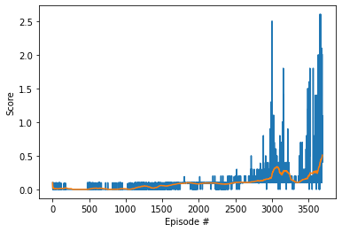

# Project 3: Tennis environment using a Multi Agent

### Introduction
This projects implements a Reinforcement Learning Multi agent approach based on the DDPG algorithm (MADDPG). The Agent has an array of Actors and a single common Critic, both actors are trained to learn how to move a table tennis raquet while playing with each other.

It is an implementation of a Multi Agent extending the DDPG algorithm with Shared Experience Replay and delayed training.

### MADDPG Implementation

The original DDPG algorithm uses two agents, an actor and a critic. Each one has two networks, a local and a target one. 
The Actor is trained to give the best possible action, given the current state of the environment. (s => a).
The Critic agent is trained to give an estimate of the reward that'd be obtained if an action A is applied at the state S. ((s, a) => V)
Local networks are trained to get the "labels" given by the target. 

In the Multi Agent version I've implemented I've extended the Agent class to conatin two Actors (as described above) and one Critic for both of them.

The MADDPG algorithm was set to run up to 5000 episodes with at most 100 iterations each, although this inner loop is broken if the environment is done (usually when one of the players has dropped the ball). 

- Restart the environment to its initial state
- Observe the environment state (for both agents at the same time, respectively)
- The agent is allowed to navigate the environment for at most `100 iterations`
  * For the first 50 episodes, the agents will perform random actions.
  * For the rest of the episodes => Send the current state to the multi-agent `act` function to get the corresponding actions for both agents
  * Perform the selected actions on the environment
  * Observe the new state, the reward, and check if the episode ended (done)
  * Accumulate the reward
  * Save the interaction in the (shared) ReplayBuffer
  * Loop over the 2 agents and perform a training step (this function internally used the state, action, reward, next_step per agent, plus the full information of the environment (including both agents points of view) to train the Critic.
  * Update current state with the new state of the environment
  * If the environment is done the finish the loop, otherwise continue
- Save the scores
- If the mean score of the last 100 episodes is 0.5 or more we've finished the training

Other Hyperparameters were set as:
- BUFFER_SIZE = int(1e6)  # replay buffer size
- BATCH_SIZE = 1024        # minibatch size
- GAMMA = 0.99            # discount factor
- TAU = 1e-3              # for soft update of target parameters
- LR_ACTOR = 1e-4         # learning rate of the actor 
- LR_CRITIC = 1e-3        # learning rate of the critic
- WEIGHT_DECAY = 0        # L2 weight decay
- TRAIN_EVERY = 1         # How many iterations to wait before calling the learn function
- NUM_AGENTS = 2          # How many agents are there in the environment
- REPEAT_LEARN = 1        # How many times to call the learn method at each episode
- UPDATE_EVERY = 4        # How many iterations to wait before updating target networks

### NN Model
The Neural Network Architecture of the `Actor` is the following:

- A Linear layer with 256 units (state_size, 256)
- A Batchnorm layer
- A LeakyRelu activation layer (x=0.01)
- A Linear layer with 128 units
- A LeakyRelu activation layer (x=0.01)
- A Linear layer with 2 units (action_size) 
- A Tanh activation layer (Actions must be in the [-1, 1] range)

The Neural Network Architecture of the `Critic` is the following:

- A Linear layer with 256 units (state_size, 256)
- A Batchnorm layer
- A LeakyRelu activation layer (x=0.01)
- A Dropout layer (p=0.30)
- A Linear layer with (128 + action_size) units (Here I concatenated the action with the encoded state)
- A LeakyRelu activation layer (x=0.01)
- A Dropout layer (p=0.30)
- A Linear layer with 1 unit (This is the output layer)

### Plot of rewards
The rewards obtained during the agent training:

### Saved model weights
- The weights of the Actor network can be found here: [Actor 1](checkpoint_actor1.pth)
- The weights of the Actor network can be found here: [Actor 2](checkpoint_actor2.pth)
- The weights of the Actor network can be found here: [Critic](checkpoint_critic.pth)

### Future Work
To improve the agent's behavior, I'd say we could:
- Use multiple instances of the environment at the same time during training. This should help the agents to explore much more of the possible states of the game.
- The environment is automatically stacking 3 continuous states, maybe stacking two of these (meaning 6 states), and then reshaping that to have a 3D tensor and use it as an input to an RNN could help with the training as well.